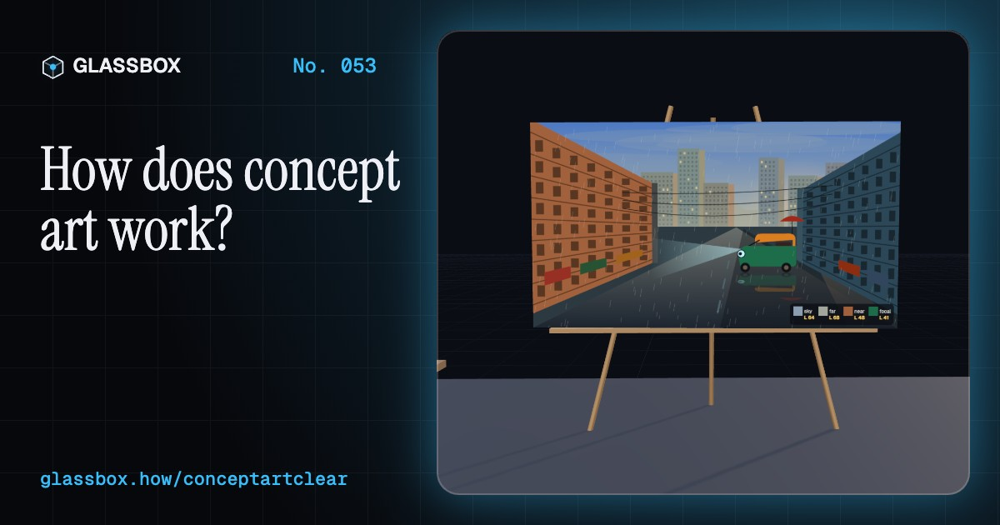
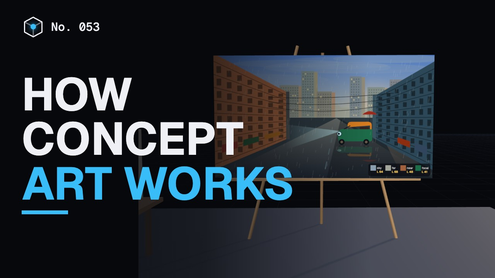
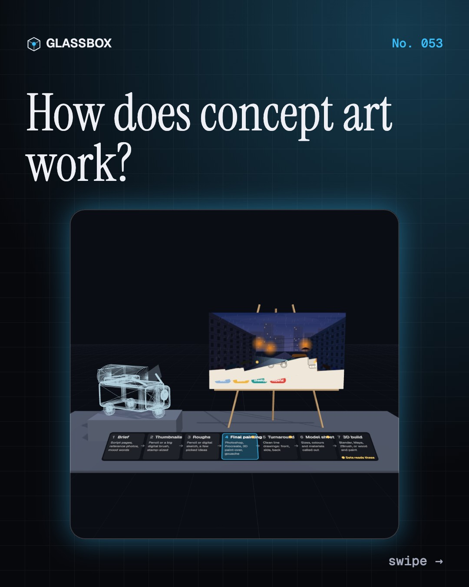
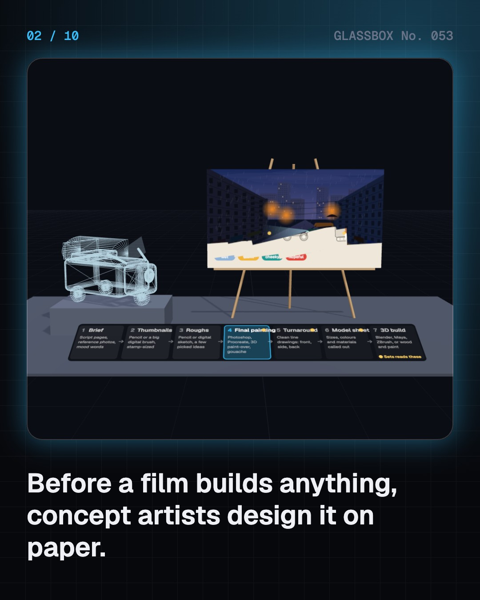
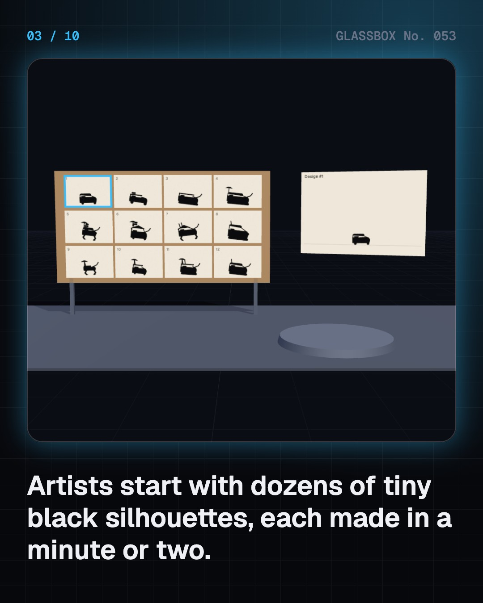
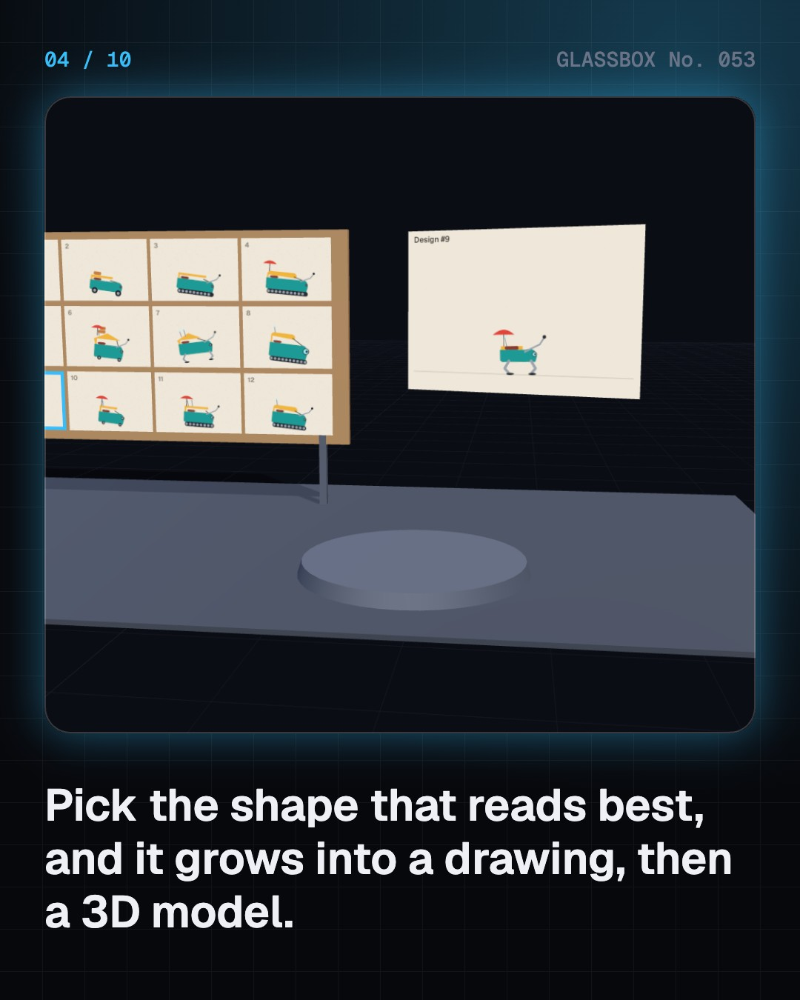

<!-- glassbox:start -->
<!-- Generated from glassbox.json by the Glassbox hub (npm run readme -- conceptartclear). Edit glassbox.json, not this block. -->
<p align="center"><a href="https://glassbox-production-fd52.up.railway.app/e/conceptartclear/"></a></p>

<h1 align="center">ConceptArtClear</h1>

<p align="center"><b>How does concept art work?</b><br>Before a film builds a single set, someone paints it. Design a robot auto-rickshaw from twelve black silhouettes, paint a monsoon street in greys then colour, paint over a 3D blockout, and draw a forest spirit from every side.</p>

<p align="center"><a href="https://glassbox-production-fd52.up.railway.app/conceptartclear/"><b>▶ Play with it</b></a> &nbsp;·&nbsp; <a href="https://glassbox-production-fd52.up.railway.app/e/conceptartclear/">Read the 60-second explainer</a> &nbsp;·&nbsp; <a href="https://glassbox-production-fd52.up.railway.app/conceptartclear/glassbox/reel.mp4">Watch the 40-second video</a></p>

<p align="center">
  <a href="https://glassbox-production-fd52.up.railway.app/e/conceptartclear/"></a>
  <a href="https://glassbox-production-fd52.up.railway.app/e/conceptartclear/"></a>
  <a href="LICENSE"></a>
  <a href="LICENSE-CONTENT.md"></a>
  <a href="#privacy"></a>
</p>

## In 60 seconds

1. **A design document for the whole crew.** Concept art decides what a film's world, characters and objects look like before anyone builds them. Carpenters, tailors, 3D modellers and the director all work from the same pictures. A design moves from a written brief to thumbnails, roughs, a final painting, a turnaround and a model sheet, then gets built.
2. **Dozens of tiny black shapes.** Artists start with thumbnails: quick, stamp-sized sketches, often solid black silhouettes. If you can tell a design apart from its outline alone, it will read on screen even far away or in the dark. Clear negative space and one big idea make a silhouette readable.
3. **Value first, then colour.** Painters plan the lights and darks in greys before choosing colours. Low sun is orange, about 2,000 to 3,500 K; high sun is near white, about 5,500 K. Haze makes far things paler, bluer and lower in contrast, and leading lines guide the eye to a focal point near a rule-of-thirds crossing.
4. **Block out in 3D, then paint over.** Environment artists often build a quick grey 3D blockout of a set, pick a camera and paint over the render. Parallel lines meet at vanishing points: one-point looking straight down a street, two-point when the camera turns, three-point when it tilts up.
5. **Every side, at the same scale.** Once a design is chosen, a turnaround shows it from the front, side and back without perspective, so everything can be measured. A model sheet adds the height next to a human, proportions in head-heights and colour codes: the page a 3D modeller builds from.
6. **New tools, same thinking.** Pencil and gouache gave way to Photoshop (1990), layers (1994), pen tablets, Procreate (2011), 3D paint-overs and photobashing. The job is still design. In India, concept artists work in VFX, animation and game studios and film art departments, and a small portfolio of original work gets them hired.

## Words worth knowing

| Term | Meaning |
|---|---|
| **Concept art** | Drawings and paintings that design how a film's world, characters and objects look before they are built. |
| **Thumbnail** | A tiny, quick sketch used to try out many ideas fast. |
| **Silhouette test** | Checking that a design can still be recognised as a solid black shape. |
| **Value** | How light or dark a colour is, ignoring its hue. |
| **Atmospheric perspective** | Far things look paler, bluer and lower in contrast because of the air in between. |
| **Vanishing point** | The point where parallel lines seem to meet in a picture drawn in perspective. |
| **Paint-over** | Painting on top of a rendered 3D view to add colour, light and detail. |
| **Turnaround** | One design drawn from the front, side and back at the same scale, so it can be built. |
| **Model sheet** | A reference page with views, proportions, sizes and colour codes for the builders. |

## A short history

**120 years from a magician drawing his own moon sets to whole worlds painted on tablets before a single frame is shot.**

- **1902** · A magician designs his own moon (Georges Méliès, Montreuil, near Paris, France)
- **1935** · The words "concept art" appear (Walt Disney studio (attributed), California, USA)
- **1937** · A storybook look for Snow White and Pinocchio (Gustaf Tenggren, California, USA)
- **1939** · The first "production designer" (William Cameron Menzies, Culver City, California, USA)
- **1950** · Mary Blair's bold colours (Mary Blair, California, USA)
- **1955** · A film planned in a sketchbook (Satyajit Ray, Calcutta (Kolkata), India)
- **1975** · Paintings that sold Star Wars (Ralph McQuarrie and George Lucas, California, USA)
- **1982** · A "visual futurist" designs two films at once (Syd Mead, California, USA)

The full story, with 28 moments, charts, people and 35 sources: [glassbox.how/e/conceptartclear/history](https://glassbox-production-fd52.up.railway.app/e/conceptartclear/history/). The data lives in [`history.json`](history.json).

## Video and slides

Made with the Glassbox studio from this box's storyboard (`window.glassbox.director`). Free to reuse under CC BY 4.0.

<a href="https://glassbox-production-fd52.up.railway.app/conceptartclear/glassbox/video.mp4"></a>

<p><a href="glassbox/slide-1.jpg"></a> <a href="glassbox/slide-2.jpg"></a> <a href="glassbox/slide-3.jpg"></a> <a href="glassbox/slide-4.jpg"></a></p>

| File | What | Size |
|---|---|---|
| [`glassbox/reel.mp4`](https://glassbox-production-fd52.up.railway.app/conceptartclear/glassbox/reel.mp4) | Reel / Short, with captions and soundtrack | 1080×1920 |
| [`glassbox/video.mp4`](https://glassbox-production-fd52.up.railway.app/conceptartclear/glassbox/video.mp4) | YouTube video, with captions and soundtrack | 1920×1080 |
| `glassbox/slide-1…10.jpg` | Instagram carousel | 1080×1350 |
| `glassbox/thumb.jpg` | YouTube thumbnail | 1280×720 |
| `glassbox/cover.jpg` | Share card and repo social preview | 1200×630 |
| [`glassbox/history-reel.mp4`](https://glassbox-production-fd52.up.railway.app/conceptartclear/glassbox/history-reel.mp4) | “History in 10 moments” Reel / Short | 1080×1920 |
| `glassbox/history-slide-*.jpg` | History carousel | 1080×1350 |
| `glassbox/post.json` | Post copy and schedule used by the publish kit | |

## Privacy

This box has no accounts and no ads, and it ships its own fonts and libraries. When you run it yourself it sends nothing anywhere. On glassbox.how, the site's `/bar.js` also loads Glassbox's analytics: **Google Analytics** to count visits (it asks first in the EU, UK and Switzerland, and stays off when your browser sends Global Privacy Control or Do Not Track) and **ClickTrust** to detect bots.

It remembers a few things **in your own browser only**, and never sends them anywhere:

| Browser storage key | What it holds |
|---|---|
| `conceptartclear.v1` | Which chapters you have opened, your best quiz scores, and sound on or off. |

Exactly what each one sees is at [glassbox.how/privacy](https://glassbox-production-fd52.up.railway.app/privacy/).

## Licences

- **Code:** [MIT](LICENSE). Use it, change it, ship it.
- **Explanations, text, images and videos** (`glassbox.json`, `glassbox/`): [CC BY 4.0](LICENSE-CONTENT.md). Credit “Glassbox, glassbox.how/e/conceptartclear”.
- **Third-party parts** keep their own licences: [three.js](https://threejs.org) (MIT), [Geist, Instrument Serif](https://openfontlicense.org) (SIL OFL 1.1).
- The Glassbox name and logo aren't covered by either licence. See the [terms](https://glassbox-production-fd52.up.railway.app/terms/).

Found a mistake? [Open an issue](https://github.com/bdeeps/conceptartclear/issues). Corrections happen in public.
<!-- glassbox:end -->

## Run it

It's plain HTML, CSS and JavaScript. No build step and no dependencies. Run locally, it contacts no other website.

```bash
python3 -m http.server 8000
```

Three.js and the fonts ship in `vendor/` and `fonts/`, so it also works offline.

Then open http://localhost:8000.

## How it's built

| File | What |
|---|---|
| `index.html`, `css/app.css` | The page and its styles |
| `js/app.js`, `js/stage.js`, `js/ui.js`, `js/kit.js` | The shared Glassbox 3D engine: chapters, 3D stage, controls, quiz, video director |
| `js/chapters/*.js` | One file per chapter: the 3D model, controls, text, key terms, quiz and video scenes |
| `js/art.js` | Shared parts: the procedural monsoon-street painter (sun height, colour temperature, haze), Tikku the robot rickshaw in 2D and 3D, Kaavu the forest spirit, silhouette readability tests, boards and props |
| `glassbox.json` | Title, question, explainer beats, key terms, browser storage and credits shown on glassbox.how |
| `reel` in each chapter | The storyboard the Glassbox studio records into short videos |
| `glassbox/` | The published video, slides, thumbnail and post copy |
| `fonts/`, `vendor/three/` | Self-hosted Geist and Instrument Serif (SIL OFL 1.1) and three.js (MIT) |
